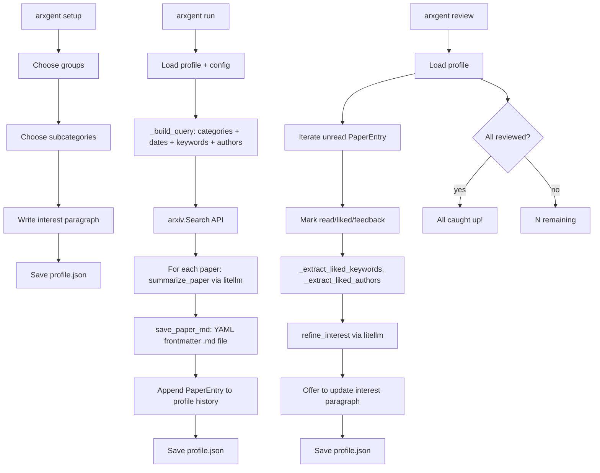
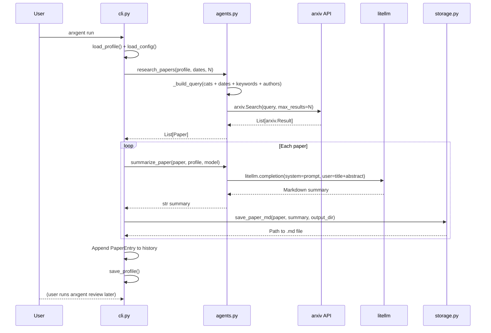
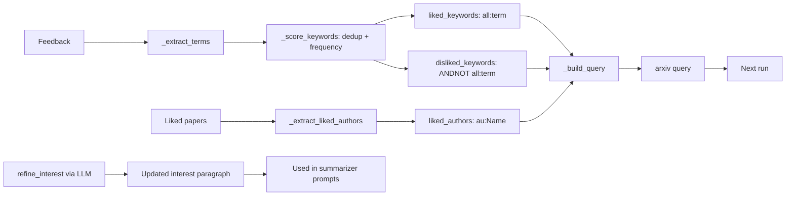

# Contributing to Arxgent

## Architecture

### Module overview

```
┌─────────────┐     ┌──────────────┐     ┌─────────────┐
│   cli.py    │────▶│  agents.py   │────▶│ storage.py  │
│  (click)    │     │ (arxiv+LLM)  │     │   (YAML md) │
└─────┬───────┘     └──────┬───────┘     └─────────────┘
      │                    │
      │     ┌──────────────┴──────────┐
      │     │                         │
      ▼     ▼                         ▼
┌──────────────┐          ┌──────────────────┐
│   config.py  │          │   profile.py     │
│ (Pydantic)   │          │ (Pydantic+setup) │
└──────────────┘          └────────┬─────────┘
                                   │
                                   ▼
                          ┌──────────────────┐
                          │  categories.py   │
                          │  (arxiv groups)  │
                          └──────────────────┘
```

### CLI command flow



### Run data flow



### Preference learning loop



### Module responsibilities

| Module | Responsibility | Key exports |
|---|---|---|
| `cli.py` | Click command group, user interaction, orchestration | `cli`, `setup`, `run`, `review`, `status` |
| `agents.py` | Arxiv query building, search, LLM summarization, interest refinement | `research_papers`, `summarize_paper`, `refine_interest`, `Paper` |
| `config.py` | Config model, persistence, env var resolution | `ArxgentConfig`, `LLMConfig`, `load_config`, `save_config` |
| `profile.py` | Profile model, persistence, setup wizard | `Profile`, `PaperEntry`, `load_profile`, `run_setup_wizard` |
| `categories.py` | Arxiv category hierarchy (8 groups, ~200 subcategories) | `GROUPS`, `get_category_name`, `get_group_for_category` |
| `storage.py` | Markdown file output with YAML frontmatter | `save_paper_md`, `_slugify` |

## Setup for development

```bash
git clone <repo> && cd arxgent
uv sync
```

## Running tests

```bash
uv run pytest tests/          # all tests
uv run pytest tests/ -v       # verbose
uv run pytest tests/ -k test_query  # filter by name
uv run pytest tests/ --cov=arxgent  # coverage
```

## Code style

- **Python 3.11+** with `from __future__ import annotations`
- **Line length**: 100
- **Formatter**: Ruff (`uv run ruff check .`)
- **Models**: Pydantic v2 (`BaseModel`, `Field`, `model_validate`, `model_dump`)
- **Types**: Use `list[str]` not `List[str]` in signatures (3.9+ style), `Optional[X]` for nullable
- **Imports**: stdlib → third-party → local, separated by blank lines
- **Tests**: pytest with `CliRunner` for CLI, monkeypatch for dependencies, `MagicMock` + `patch` for external APIs

## Key design decisions

- **No AutoGen**: Sequential research→summarize is simpler as functions; can be added later
- **Query built programmatically**: Categories + dates + feedback keywords/authors constructed in Python rather than LLM-generated — deterministic, zero extra API cost
- **Keyword extraction via regex + frequency**: Not LLM — keeps latency low for v1
- **Spaces in arxiv queries**: Use actual spaces (not `+`) in query strings so the `arxiv` library's `urlencode` encodes them correctly (spaces → `+` rather than `+` → `%2B`)

## Adding a new feature

1. Add the logic in the appropriate module (`agents.py`, `profile.py`, etc.)
2. Wire up the CLI command in `cli.py`
3. Add tests in the corresponding `tests/test_*.py` file
4. Run `uv run pytest tests/` to verify
5. Run `uv run ruff check .` for style

## Pull request process

1. Ensure all tests pass
2. Add tests for new functionality
3. Update README if changing user-facing behavior
4. Open a PR with a concise description of the change
