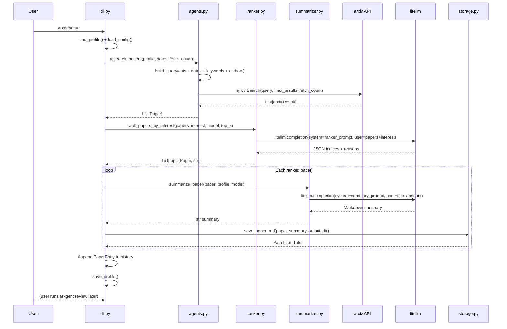

# Contributing to Arxgent

## Architecture

### Module overview

```
Pipeline modules (called in order during `arxgent run`):

┌──────────────┐     ┌──────────────┐     ┌──────────────┐
│  agents.py   │────▶│  ranker.py   │────▶│summarizer.py │
│  (arxiv)     │     │ (LLM rank)   │     │  (LLM sum)   │
└──────────────┘     └──────────────┘     └──────┬───────┘
                                                  │
                                                  ▼
                                          ┌──────────────┐
                                          │  storage.py  │
                                          │  (YAML md)   │
                                          └──────────────┘

Supporting modules:

┌──────────────┐     ┌──────────────┐     ┌──────────────┐
│   config.py  │     │  profile.py  │     │categories.py │
│ (Pydantic)   │     │ (Pyd+setup)  │     │(arxiv groups)│
└──────────────┘     └──────┬───────┘     └──────────────┘
                            │
                            ▼
                   ┌──────────────────┐     ┌──────────────┐
                   │  interest.py     │     │  feedback.py │
                   │ (LLM refine)     │     │ (keyword ext)│
                   └──────────────────┘     └──────────────┘
```

### CLI command flow

```mermaid
flowchart TD
    A[arxgent setup] --> B[Choose groups]
    B --> C[Choose subcategories]
    C --> D[Write interest paragraph]
    D --> E[Save profile.json]

    F[arxgent run] --> G[Load profile + config]
    G --> H[_build_query: categories + dates + keywords + authors]
    H --> I[arxiv.Search API (fetch_count)]
    I --> J[rank_papers_by_interest via LLM]
    J --> K[For each ranked paper: summarize_paper via LLM]
    K --> L[save_paper_md: YAML frontmatter .md file]
    L --> M[Append PaperEntry to profile history]
    M --> N[Save profile.json]

    O[arxgent review] --> P[Load profile]
    P --> Q[Iterate unread PaperEntry]
    Q --> R[Mark read/liked/feedback]
    R --> S[_extract_liked_keywords, _extract_liked_authors]
    S --> T[refine_interest via litellm]
    T --> U[Offer to update interest paragraph]
    U --> V[Save profile.json]

    Q --> W{All reviewed?}
    W -- yes --> X["All caught up!"]
    W -- no --> Y["N remaining"]
```

### Run data flow



### Preference learning loop


### Module responsibilities

| Module | Responsibility | Key exports |
|---|---|---|
| `cli.py` | Click command group, user interaction, orchestration | `cli`, `setup`, `run`, `review`, `status` |
| `agents.py` | Arxiv query building and search | `research_papers`, `_build_query`, `Paper` |
| `summarizer.py` | LLM paper summarization | `summarize_paper` |
| `ranker.py` | LLM-based paper ranking by interest | `rank_papers_by_interest` |
| `interest.py` | LLM-based interest refinement | `refine_interest` |
| `feedback.py` | Keyword and author extraction from feedback | `_extract_liked_keywords`, `_extract_disliked_keywords`, `_extract_liked_authors` |
| `config.py` | Config model, persistence, env var resolution | `ArxgentConfig`, `LLMConfig`, `load_config`, `save_config` |
| `profile.py` | Profile model, persistence, setup wizard | `Profile`, `PaperEntry`, `load_profile`, `run_setup_wizard` |
| `categories.py` | Arxiv category hierarchy (8 groups, ~200 subcategories) | `GROUPS`, `get_category_name`, `get_group_for_category` |
| `storage.py` | Markdown file output with YAML frontmatter | `save_paper_md`, `_slugify` |

## Setup for development

```bash
git clone <repo> && cd arxgent
uv sync --group dev
```

## Running tests

```bash
uv run pytest tests/          # all tests
uv run pytest tests/ -v       # verbose
uv run pytest tests/ -k test_query  # filter by name
uv run pytest tests/ --cov=arxgent  # coverage
```

## CI pipeline

The project uses GitHub Actions (`.github/workflows/ci.yml`) to run linting and tests on every push and pull request to `main`:

- **Lint**: `uv run ruff check .`
- **Test**: `uv run pytest tests/`

## Code style

- **Python 3.11+** with `from __future__ import annotations`
- **Line length**: 100
- **Formatter**: Ruff (`uv run ruff check .`)
- **Models**: Pydantic v2 (`BaseModel`, `Field`, `model_validate`, `model_dump`)
- **Types**: Use `list[str]` not `List[str]` in signatures (3.9+ style), `Optional[X]` for nullable
- **Imports**: stdlib → third-party → local, separated by blank lines
- **Tests**: pytest with `CliRunner` for CLI, monkeypatch for dependencies, `MagicMock` + `patch` for external APIs

## Key design decisions

- **No AutoGen**: Sequential research→rank→summarize is simpler as functions; can be added later
- **Query built programmatically**: Categories + dates + feedback keywords/authors constructed in Python rather than LLM-generated — deterministic, zero extra API cost
- **Keyword extraction via regex + frequency**: Not LLM — keeps latency low for v1
- **LLM ranking**: Papers are fetched in bulk (`fetch_count`, default 50), ranked by interest via LLM, then only the top `num_papers` are summarized — reduces cost on high-volume days
- **Spaces in arxiv queries**: Use actual spaces (not `+`) in query strings so the `arxiv` library's `urlencode` encodes them correctly (spaces → `+` rather than `+` → `%2B`)

## Adding a new feature

1. Add the logic in the appropriate module (`agents.py`, `summarizer.py`, `ranker.py`, etc.)
2. Wire up the CLI command in `cli.py`
3. Add tests in the corresponding `tests/test_*.py` file
4. Run `uv run pytest tests/` to verify
5. Run `uv run ruff check .` for style

## Pull request process

1. Ensure all tests pass
2. Add tests for new functionality
3. Update README if changing user-facing behavior
4. Open a PR with a concise description of the change
